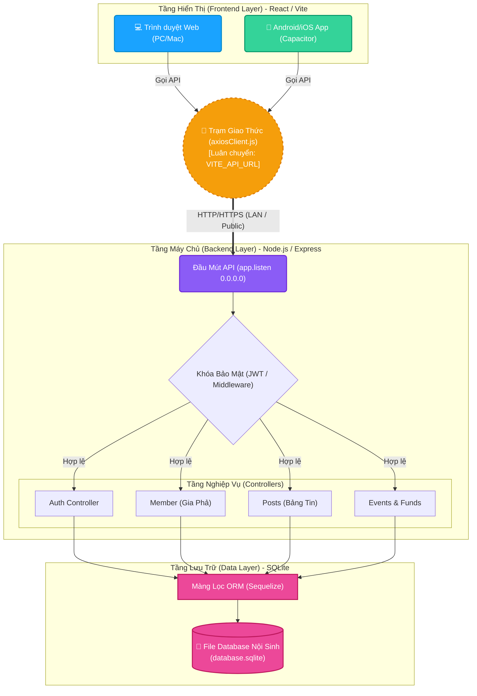

# Báo Cáo Phân Tích Kiến Trúc Máy Trạm (Architectural Review)

**Người đánh giá:** The Architect Agent
**Dự án:** Ho-Pham Family Tree (Cross-Platform Version 2.0)
**Thời điểm đánh giá:** Ngay sau mốc hợp nhất Mobile (CapacitorJS)

---

## 1. Sơ Đồ Khối (Mô Hình Rễ Cây) Hiện Tại

Dưới đây là hình vẽ trực quan diễn giải luồng trao đổi dữ liệu từ thiết bị của Người dùng (Client) đục thẳng xuống Ổ cứng (Database) của Hệ thống.

---

## 2. Đánh Giá Điểm Mạnh Kiến Trúc Hiện Tại

- **Single Source of Truth (1 Nguồn Code Duy Nhất)**: Lõi ReactJS hiện tại được bọc bởi `CapacitorJS`, xuất đa nền tảng.
- **Tính Di Động Dữ Liệu Rất Cao (SQLite)**: Toàn bộ Cây Gia Phả được đóng gói trong một file vật lý duy nhất. 
- **Bảo Mật Tầng Tiêu Chuẩn (JWT)**: Hệ thống dùng chìa khóa JSON Web Token.

---

## 3. Lỗ Hổng Nút Thắt (Bottlenecks)

1. **Rào Cản Mở Rộng Hình Ảnh (Storage Scale System):** Database sẽ quá tải nếu lưu ảnh dưới dạng Base64. (Nên dùng Cloudinary)
2. **Rào Cản Về Lưu Lượng Gia Phả (Data Rendering Tree):** Render quá nhiều Node sẽ giật. (Nên dùng LazyLoading)
3. **Cơ chế Thông Báo Đẩy Thời Gian Thực (Push Notification / Socket.io)**: Thiếu WebSockets để gửi Noti.
